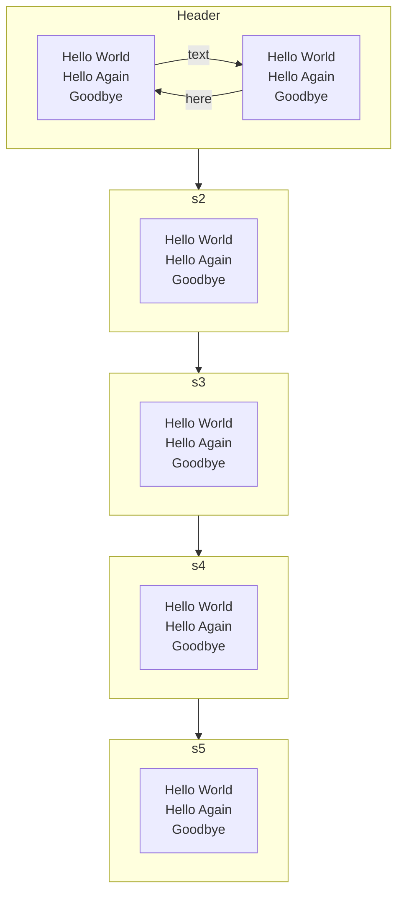
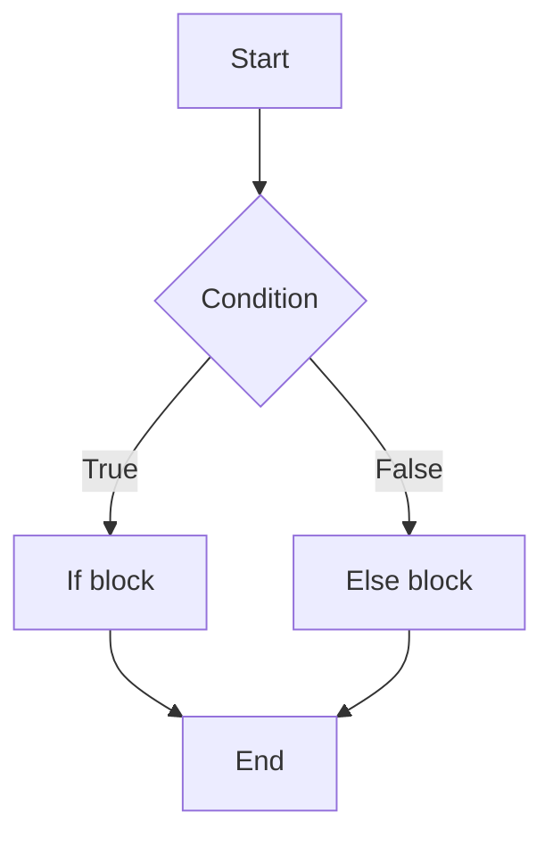
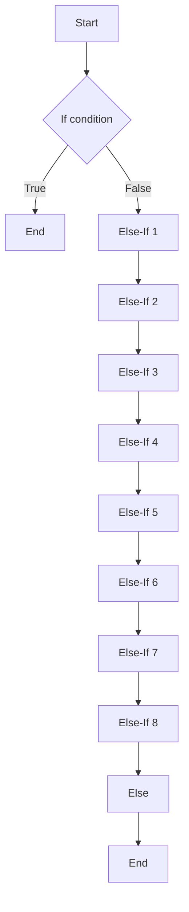
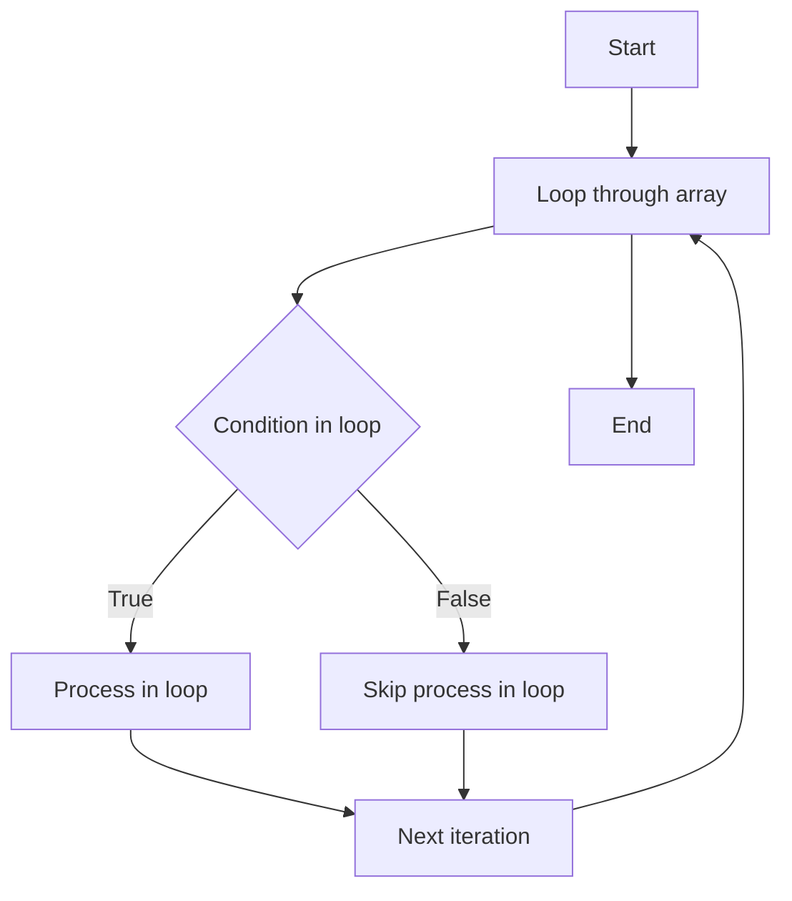

# 13-05-23

## Mermaid Practise

```mermaid

flowchart TD
s1 --> s2
s2 --> s3
s3 --> s4
s4 --> s5

subgraph s1["Header"]

direction LR

s1Problems["
    Hello World
    Hello Again
    Goodbye
    "]

s1DesProblems["
    Hello World
    Hello Again
    Goodbye
"]

s1Problems -- text --> s1DesProblems
s1DesProblems -- here --> s1Problems

end

subgraph s2
s2Problems["
    Hello World
    Hello Again
    Goodbye
    "]
end

subgraph s3
s3Problems["
    Hello World
    Hello Again
    Goodbye
    "]
end

subgraph s4
s4Problems["
    Hello World
    Hello Again
    Goodbye
    "]
end

subgraph s5
s5Problems["
    Hello World
    Hello Again
    Goodbye
    "]
end

```

```mermaid

flowchart TD
A[Start] --> B{Condition}
B -- True --> C[If block]
B -- False --> D[Else block]
C --> E[End]
D --> E


```

```mermaid

flowchart TD
E[Else-If 3]
F[Else-If 4]
G[Else-If 5]
H[Else-If 6]
I[Else-If 7]
J[Else-If 8]
K[Else]
L[End]

A[Start] --> B{"If condition"}
B -- True --> BEnd["End"]
B -- False --> C
C[Else-If 1] --> D[Else-If 2]
D --> E
E --> F
F --> G
G --> H
H --> I
I --> J
J --> K
K --> L


```

```mermaid

flowchart TD

M[Start] --> N[Loop through array]
N --> O{Condition in loop}
O -- True --> P[Process in loop]
O -- False --> Q[Skip process in loop]
P --> R[Next iteration]
Q --> R
R --> N
N --> S[End]

```