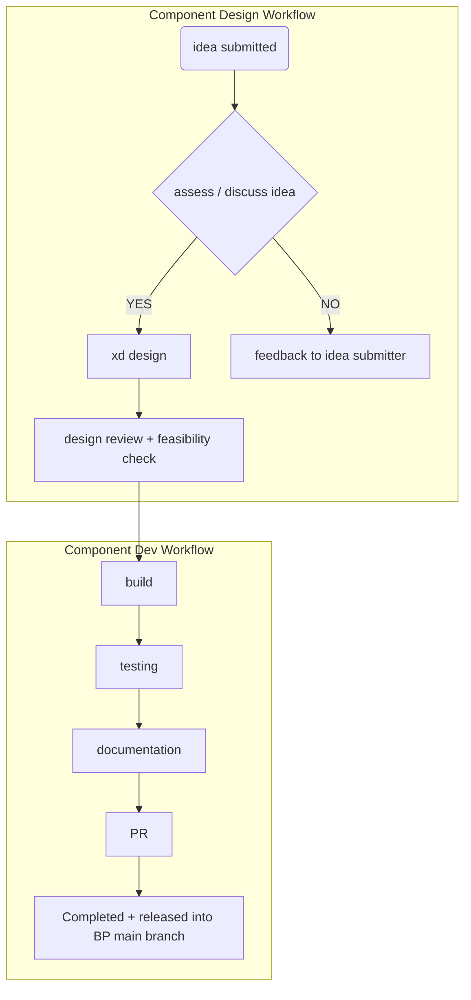

# BSK-Els Round 2 Planing Meet

Rough notes to edit later

## Catch up notes and thoughts :
- roll outs update
  - mine
  - wins
  - issues
  - others
    - wins
    - take up
    - issues
    - training

- system and components
- prev doc
- components list - inc form design
- recky existing sites inc :
  1. mon
  2. horizon
  3. frf
  4. jb - hero
  5. navs / headers and footers collection
- ideas doc to discuss inc cdn
-
- shortlist updates with ajax improvements inc ready for hypes testing now (simplified)
- site speed / bundling and the new lib
- training with static via codesandbox (acc request for testing)
- css vars scripting
Other
- lean / experiment capacity for build speed? Working static-first

## Notes

- Barbs catch up with Kate and Rach
  - not enough components to not do quite a bit custom at this time
  - issues :
    - how to build things out in xd something to work on as unifiied approach

- Header as example talk through
  -  one core component with options / api on each sub-component
  -  variations built out and then used as the bluesky header
  -  specific type of component with options to transform :
     -  header component - altered via options
     -  nav (sub) component - altered via options
     -  spotllight component

- Feedback from Devs
  -  Positive so far

- Next steps :
  - static elements first discussed
  - work as next step as making into componenent

  - How do we get to use of lib as quick as possible?
  - round 2 sprint

  - ### temp workflow for now
  - review sites and list built out components we can use
  - list for design feasibility review (reverse of current build process)
  - designs (xd) from these identfied already-built-out components
  - lift from existing, re-work (as static?) to match xd
  - build out as fully-fledged components
  - testing (design)
  - add to bp

## Crossover with backlog + what we've built out

- PR process for bsk-els
- Its thorough
- Pull component-work branch to local and spin up prio to review
- NOT generally just a quick eye-ball of code as a maintenance job
- Should be about going back with ideas

## Workflow Ideas 3

- Clickup board FE improvements components list
  - https://app.clickup.com/2692048/v/l/6-200569953-1

## Actions

Speak with Matt on status on tasks
https://app.clickup.com/2692048/v/b/2j4yg-114230

Go through whole list of Design Review on here
https://app.clickup.com/2692048/v/l/6-200569953-1
And check what is already done

## Next steps
- Finese the list first
  - Names, tasks, details under each etc
  - Prioritise in relation to build speed
  - Match up any from current build not with concept
  - Then review existing sites and list any partials that can be made into components
  - ! Header / nav is a prio for this round - as a re-working
  - Add tasks to list

### Tasks to add to list
- Bundle size reduction

### bsk-els core list
Tasks are self-contained and scoped. Component iteration happens via new items added to teh list after current is signed-off.
https://app.clickup.com/2692048/v/l/f/110654556?pr=6776151

To discuss this arvo
- https://app.clickup.com/t/2x7mj93
- https://app.clickup.com/t/2x7me5r
- https://app.clickup.com/t/30mc9tq
- https://app.clickup.com/t/2x7mhbe

qs : CW ones to review together as not sure on task details completely and where they best fit

Header Nav Task

