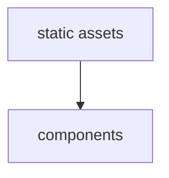
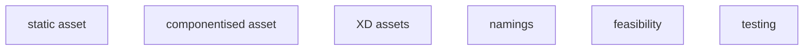

# Example Worflow

```mermaid

flowchart TD

A[static assets] --> B[components]


```
## Workflow Ideas 2

```mermaid

flowchart TD

A[static asset]
B[componentised asset]
C[XD assets]
D[namings]
E[feasibility]
F[testing]

```