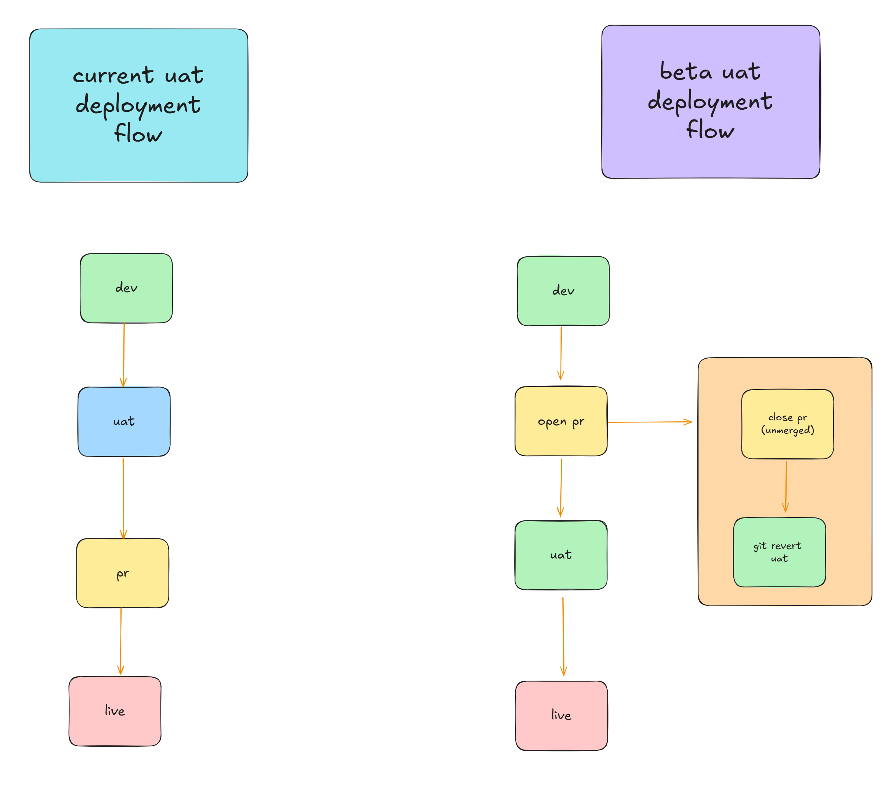
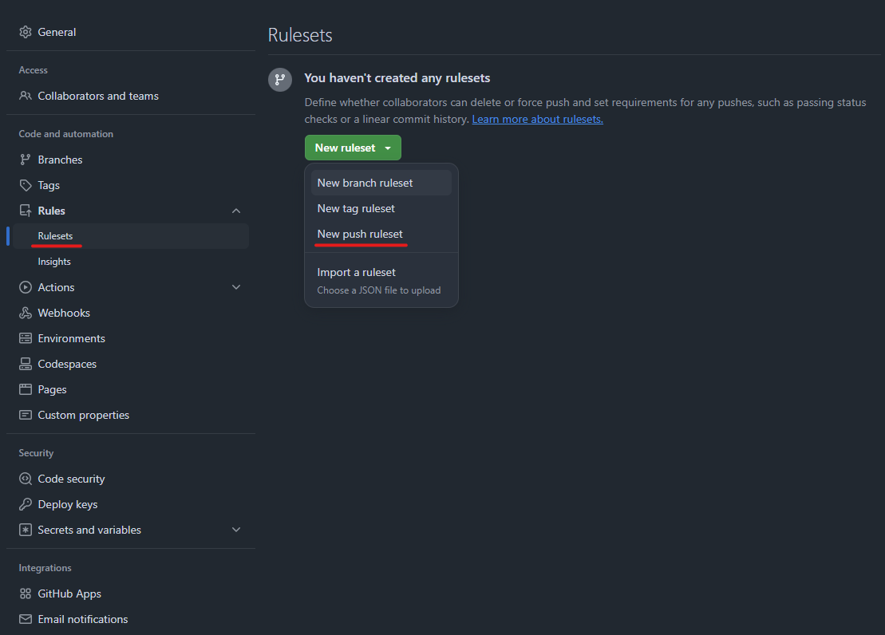
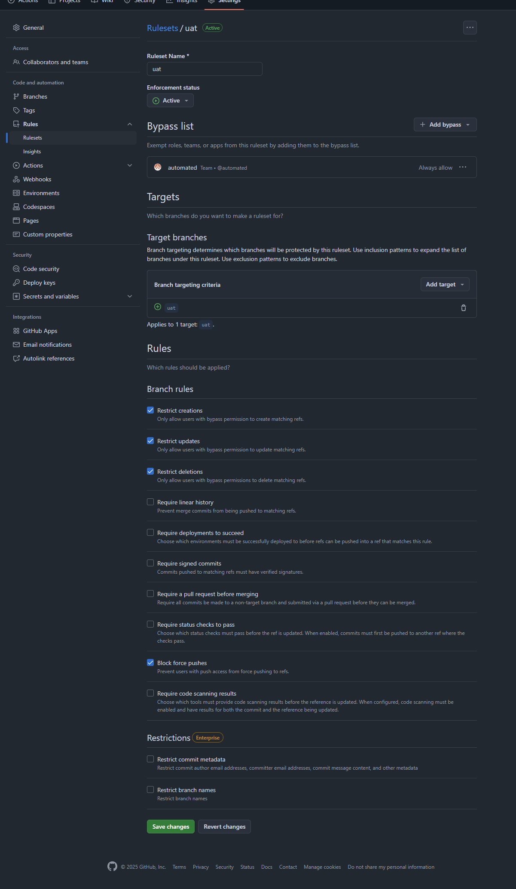

# UAT Deployment Beta Test 🚀

We are currently testing a new UAT deployment workflow.

## The problem ⚠️

We are not using UAT in an optimal way. Some problems are:  

- Testing is not done consistently on UAT
- Confusion (in FE / CS) about how Dev and UAT differ /what each is for
- Jobs being moved to the 'go live' step after Dev test only
- Stale UAT branches missing changes / problems with merging into UAT
- The way we are using UAT is slowing us down when it comes to getting jobs live

## The solution ✅

- Keep UAT for staging
- Auto-deploy to UAT when a PR is created, instead of manually deploying as a distinct ClickUp Stage
- Add a reminder to the PR body to check UAT before progressing
- If there are problems on UAT and the PR needs closing, that would trigger a git revert of that last merge commit to UAT keeping it still the same as live site

## Actions to set up Beta Testing 🛠️

After we have identified the dev and site that should be tested on we need to do the following: 

- Communication with CS
- Install the Beta Workflow

### Communication with CS 📢

- First and foremost we need to make sure CS are okay with us testing the new process and workflow on the site(s) we have identified
- This is important because we are not just changing the workflow but adjusting the testing process. 
- See Notes on Testing Process as this is the info we need to share with CS
  
### Install the Beta Workflows 💾

- Clone the repo for the site you want to add the beta workflow to
- Create a new branch `beta-uat-workflow`
- From the project root run `npx @alexrafter/uat-workflow-installer`
- This will add new workflow the files to your project
- You should now have : 
	- a new `.github/workflows/uat-on-pr.yml` workflow
	- a new `.github/workflows/revert-on-pr-close.yml` workflow
	
- Next, create a new ruleset for the site repo that you want to add the beta workflow to
  
	- step 1 under the repo 'settings' tab, create a new push ruleset

	- step 2 set the following rules for the new ruleset

*This ruleset ensures the only pushes that can be made to `origin uat` are those made by a member of Bluesky's `automated` team (this will usually be a our `@front-end-bsk` account).*

- Next, merge your changes into `dev`,  then push to `origin dev` to check the deploy on push still works correctly.
- If all works and deploys correctly, create a PR ahead of merging your changes into main
- After the changes are merged into main branch the repo should now be set up correctly. At this point : 
	- pushes to `origin dev` will be unaffected - and will trigger deploy to the dev site as normal
	- we will not be able to manually push to `origin uat` anymore
	- instead, when a PR is created the changes contained in that PR will be automatically merged into `origin uat` via the new workflow. This in turn will trigger the existing `.github\workflows\deployment_caller.yml` workflow just as if we had manually pushed  to `origin uat` ourselves

### Notes on Testing Process 📝
- All jobs for the test site should be put with the developer involved with the beta testing wherever possible. If this can't be done, it may be that the site is not a good candidate for early beta testing.
- Changes should be tested on DEV by CS
- After testing the can progress to check on live
- UAT will be used as a staging branch. Its will be primarily used by the FE Dev and potentially the reviewer for testing changes
- The changes will be auto-deployed to UAT when the FE Developer opens a new PR.