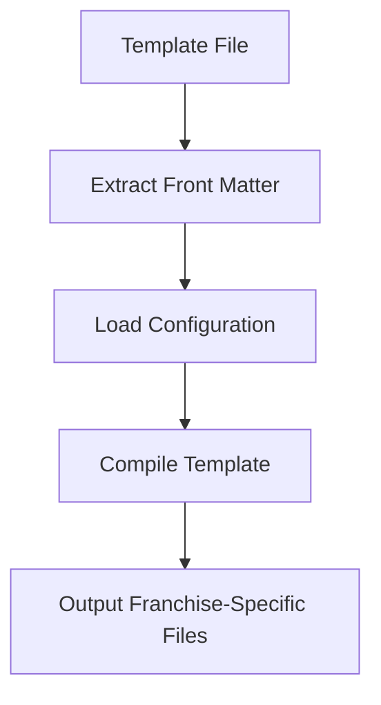
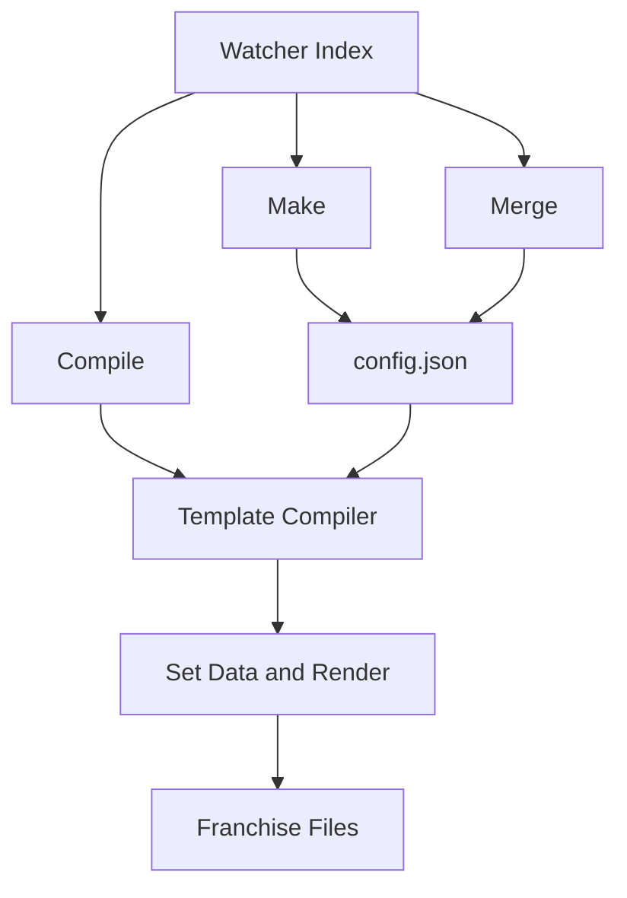
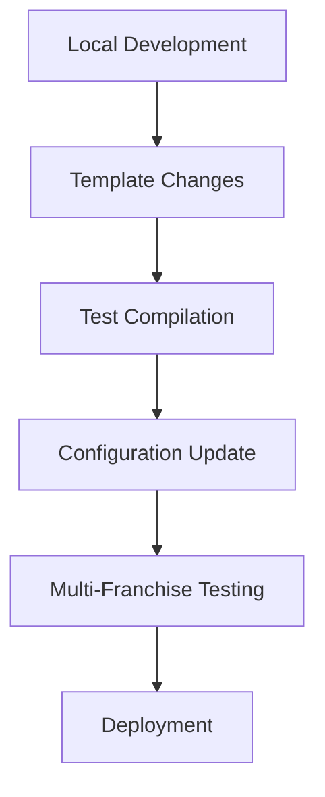

# Watcher Codebase Documentation Overview

This documentation is meant for maintainers and developers who need to understand the core logic and structure of the watcher script system. If you are looking for how to use watcher as a build dev please refer to the CLI documentation.

## Contents

- [System Overview](#system-overview)
- [Core Components](#core-components)

## System Overview

The watcher system is a Node.js-based tool designed to manage and compile template files across multiple franchises. It consists of several interconnected modules that handle template compilation, data management, and real-time file watching.

## Core Components

### 1. Entry Point (`src/scripts/watcher/index.mjs`)

The main entry point handles CLI flags and directs execution:
- It supports four main operations: `watch`, `launch`, `make`, and `compile`
	- `watch` watches for file changes, and recompiles templates based on those changes,  writing a final version of the file for each franchise
	-  `make` resets the config, pulling in data 
	- `launch` starts the data viewer server
	-  `compile` loops over all files in the watcher directory, compiles the templates, and writes a final version of the file for each franchise

- If no flags are provided, defaults to watching for file changes, and recompiling templates based on those changes
  
### 2. Core Modules

#### File Watcher (`src/scripts/watcher/logic/index.mjs`)
- Uses `chokidar` to monitor the `./watcher` directory for changes
- Triggers template compilation on file changes
- Implements debouncing to prevent excessive merge operations

#### Template Compiler (src/scripts/watcher/modules/compile-template.mjs`)

- Processes individual template files
- Extracts front matter using `gray-matter`
- Coordinates with franchise-specific configurations

#### Data Management
- `logic/make.mjs`: Creates initial configuration objects from template files
- `logic/merge.mjs`: Handles synchronization between template front matter and configuration
- Configuration stored in `config/config.json`

### 3. Data Viewer (`data-view/`)
A web-based interface for managing configuration data:
- Express.js server (`logic/launch.mjs`)
- Frontend UI for viewing and editing configuration
- Real-time configuration updates

## Key Files and Their Roles

```
src/scripts/watcher/
├── config/
│   ├── config.json         # Central configuration store
│   └── franchises.mjs      # Franchise definitions
├── data-view/              # Web UI components
├── logic/                  # Core operation modules
└── modules/               # Shared functionality
```

## Core Logic Flow

1. **Template Processing**
   


## Key Technical Concepts

### 1. Template Compilation
- Templates use JavaScript template literals for dynamic content
- Front matter defines template-specific configuration
- Global configuration available to all templates

### 2. Configuration Synchronization
- Maintains consistency between template front matter and central configuration
- Handles property addition and removal
- Supports franchise-specific overrides

### 3. File Structure
- Franchise-specific directories created automatically
- Maintains directory structure from template to output
- Handles both `.aspx` and `.ascx` files

## Development Guidelines

1. **Adding New Features**
- Add new CLI flags in `src/scripts/watcher/index.mjs`
- Implement corresponding logic in `src/scripts/watcher/modules`
- Update configuration schema as needed

2. **Modifying Templates**
- Ensure front matter follows established patterns
- Use expressions in template literals to use global or franchise data 

1. **Configuration Changes**
- Use the data viewer for testing
- Verify changes propagate correctly
  
## Dependencies
Key external dependencies:
- `chokidar`: File watching
- `gray-matter`: Front matter parsing
- `shelljs`: File system operations
- `express`: Data viewer server 


## Core Module Logic Overview

### 1. Watcher Logic (`logic/index.mjs`)
```javascript
// Key functionality:
// - File watching with chokidar
// - Debounced merge operations
// - Template compilation triggering

chokidar.watch('./watcher', {
  // Watches for changes in watcher directory
}).on('change', (path, stats) => {
  // 1. Normalizes file path
  // 2. Triggers template compilation
  // 3. Triggers debounced merge operation
});
```
**Notable Points:**
- Uses debouncing to prevent multiple rapid merges
- Normalizes file paths for cross-platform compatibility
- Focuses on `.aspx` and `.ascx` files

### 2. Make Logic (`logic/make.mjs`)
```javascript
// Purpose: Initial configuration generation
// Process:
// 1. Finds all template files
// 2. Creates franchise-specific configurations
// 3. Extracts front matter
// 4. Generates config.json

const configObj = {}
franchises.forEach(franchise => configObj[franchise] = {})
matterFiles.forEach(makeConfigObj);
```
**Key Operations:**
- Creates initial configuration structure for each franchise
- Processes front matter from all template files
- Handles global configuration separately
- Maintains path references in configuration

### 3. Merge Logic (`logic/merge.mjs`)
```javascript
// Purpose: Synchronize template changes with configuration
// Key operations:
// 1. Cache current template states
// 2. Check for new properties
// 3. Check for removed properties
// 4. Update configuration if changed

matterFiles.forEach(addToCache);
Object.keys(matterCache).forEach(checkForNewProperties)
Object.keys(config[franchises[0]]).forEach(checkForUnusedProperties)
```
**Important Aspects:**
- Maintains a matter cache for comparison
- Handles property addition and removal
- Updates all franchises when changes occur
- Only writes to config if changes detected

### 4. Compile Template Module (`modules/compile-template.mjs`)
```javascript
// Purpose: Process individual template files
// Process:
// 1. Extract front matter
// 2. Load configuration
// 3. Process each franchise
// 4. Generate output files

async function compileTemplate(file) {
    const matterFile = matter.read(file);
    // Process each franchise with template
    franchises.forEach(franchise =>
        setDataAndRenderFromTemplate(config, franchise, file, matterFile, fileName))
}
```
**Key Features:**
- Handles template processing per franchise
- Integrates global configuration
- Manages file path handling
- Error handling for configuration loading

### 5. Set Data and Render Module (`modules/set-data-and-render-template.mjs`)
```javascript
// Purpose: Template rendering and file output
// Process:
// 1. Prepare data for rendering
// 2. Evaluate template
// 3. Create output directories
// 4. Write files

function setDataAndRenderFromTemplate(config, franchise, file, matterFile, fileName) {
    // Merge global config with template data
    dataToRender.global = config[franchise]['global'];
    // Evaluate template with data
    const populatedTemplate = populateTemplate(dataToRender, matterFile.content);
    // Write to franchise-specific location
}
```
**Notable Points:**
- Handles template evaluation using template literals
- Manages directory structure creation
- Cleans up template output (whitespace, newlines)
- Maintains franchise-specific paths

### 6. Process All Files Module (`modules/process-all-files.mjs`)
```javascript
// Purpose: Batch process all template files
// Process:
// 1. Find all relevant files
// 2. Filter unwanted files
// 3. Compile each template

async function processAllFiles() {
    const files = [...new Set([...sh.find('./watcher')
        .filter(file => !file.match(/watcher-ignore|shared.aspx|global.aspx/))
        .filter(file => file.match(/\.aspx$|\.ascx$/))
    ])]
}
```
**Key Features:**
- Handles bulk template processing
- Filters out ignored files
- Removes duplicates
- Focuses on specific file types

## Data Flow Between Modules



Here are several valuable additions that would enhance the technical documentation:

## 1. Configuration Schema Documentation
```json
// Example config.json structure
// Example config.json structure

{

    "ford": {

        "watcher/contact-us/default.aspx": {

            "path": "watcher/contact-us/default.aspx",

            "pageTitle": "Placeholder Contact Us"

        },

        "watcher/default.aspx": {

            "path": "watcher/default.aspx",

            "franchise": "ford",

            "dealerships": [

                123,

                456,

                789,

                999,

                101,

                223,

                343,

                888,

                1212,

                34567

            ],

            "dealershipsToExclude": [

                123,

                456,

                789

            ],

            "title": "Default Data Homepage",

            "homie": "home",

            "tester": "thingy",

            "dat": "This is a test",

            "demo": "This is a demo",

            "another": "another one to pull in",

            "obj": {

                "a": 1,

                "b": 2,

                "c": 3

            }

        },

        "global": {

            "path": "global",

            "webId": "1234567890",

            "locations": [

                "sussex",

                "kent",

                "coventry"

            ],

            "dealerships": [

                123,

                456,

                789,

                999,

                101,

                223,

                343,

                888,

                1212,

                34567

            ]

        },

        "watcher/inc/modules/cookies/cookie-compliance.aspx": {

            "path": "watcher/inc/modules/cookies/cookie-compliance.aspx",

            "cookieId": "cookie-compliance",

            "cookieName": "cookie-compliance"

        },

        "watcher/inc/modules/search/refine-search.aspx": {

            "path": "watcher/inc/modules/search/refine-search.aspx",

            "searchRef": "refine-search",

            "modelRef": "ModelField",

            "makeRef": "MakeField",

            "locationRef": "LocationField",

            "minPriceRef": "MinPrice",

            "maxPriceRef": "MaxPrice"

        },

        "watcher/inc/test.aspx": {

            "path": "watcher/inc/test.aspx",

            "franchise": "ford",

            "dealerships": [

                123,

                456,

                789,

                999,

                101,

                223,

                343,

                888,

                1212,

                34567

            ],

            "dealershipsToExclude": [

                123,

                456,

                789

            ],

            "title": "Default Data Homepage",

            "homie": "home",

            "tester": "thingy",

            "dat": "This is a test",

            "another": "another one to pull in",

            "obj": {

                "a": 1,

                "b": 2,

                "c": 3

            }

        },

        "watcher/offers/default.aspx": {

            "path": "watcher/offers/default.aspx",

            "title": "Offers",

            "dealers": [

                124,

                26,

                1

            ],

            "newProp": "Hello from the template"

        },

        "watcher/used-cars/default.aspx": {

            "path": "watcher/used-cars/default.aspx",

            "franchise": "ford",

            "dealerships": [

                123,

                456,

                789,

                999,

                101,

                223,

                343,

                888,

                1212,

                34567,

                88888

            ],

            "dealershipsToExclude": [

                123,

                456,

                789,

                999

            ],

            "title": "Default Used Page"

        }

    }

}
```
Include:
- Required properties
- Optional properties
- Property types and constraints
- Examples of valid configurations

## 2. Troubleshooting Guide

Common Issues and Solutions:
1. **Configuration Sync Issues**
   - Symptoms: Template changes not reflecting
   - Possible causes: File permissions, corrupted config
   - Resolution steps

2. **Template Compilation Failures**
   - Common syntax errors
   - Front matter formatting issues
   - Global configuration missing

3. **File Watching Problems**
   - File system permissions
   - Watch path issues
   - Performance problems with large directories

## 3. Testing Strategy
```javascript
// Example test scenarios
- Template compilation with various data structures
- Configuration merging edge cases
- File system operations across platforms
- Error handling scenarios
```
Include:
- Test coverage requirements
- Critical test scenarios
- Manual testing procedures

## 4. Performance Considerations

1. **File Watching**
   - Optimal watch configurations
   - Debounce timing considerations
   - Memory usage patterns

2. **Template Compilation**
   - Performance impact of large templates
   - Caching strategies
   - Resource usage guidelines

## 5. Security Considerations

1. **File Operations**
   - Path traversal prevention
   - File permission management
   - Input validation

2. **Configuration Management**
   - Access control
   - Data validation
   - Secure storage practices

## 6. Development Workflow



Include:
- Branch strategy
- Code review requirements
- Testing requirements
- Deployment process

## 7. API Documentation

For the data viewer and any other programmatic interfaces:
```javascript
// Example API endpoints
GET /config
POST /submit
```
Include:
- Request/response formats
- Authentication requirements
- Rate limiting
- Error responses

## 8. Monitoring and Logging

1. **Log Levels**
   ```javascript
   // Example logging strategy
   console.error() // Critical errors
   console.warn()  // Important warnings
   console.info()  // Status information
   console.debug() // Debug information
   ```

2. **Key Metrics**
   - Template compilation times
   - Configuration sync frequency
   - Error rates
   - Resource usage

## 9. Dependency Management

1. **Critical Dependencies**
   ```json
   {
     "chokidar": "File watching",
     "gray-matter": "Front matter parsing",
     "express": "Data viewer server",
     "shelljs": "File operations"
   }
   ```

2. **Version Requirements**
   - Compatibility matrix
   - Update procedures
   - Breaking changes history

## 10. Architecture Decision Records (ADRs)

Document key technical decisions:
```markdown
# ADR 1: Template Engine Selection
Date: YYYY-MM-DD
Status: Accepted
Context: Need for template processing
Decision: Use JavaScript template literals
Consequences: Simple but powerful templating
```

## 11. Contributing Guidelines

1. **Code Style**
   - Linting rules
   - Formatting requirements
   - Documentation requirements

2. **Pull Request Process**
   - Branch naming
   - Commit message format
   - Review requirements

## 12. Deployment Guide

1. **Environment Setup**
   - Required dependencies
   - Configuration files
   - Permission requirements

2. **Deployment Steps**
   - Installation process
   - Configuration setup
   - Verification steps

These additions would make the documentation more comprehensive and useful for different types of users (developers, maintainers, operators). Each section could be expanded based on the specific needs of your team and the complexity of your implementation.

**User**:

Take the best of these suggestions, and create additional documentation based on those - only where you can document the existing code as it is, and where you can add something helpful.

**Cursor**:

I'll focus on the most relevant and implementable documentation based on the existing codebase:

# Additional Technical Documentation

## Configuration Schema
The configuration system uses a nested structure to manage franchise-specific and global settings:

```javascript
{
  "ford": {                                    // Franchise name
    "watcher/default.aspx": {                  // Template path
      "path": "watcher/default.aspx",          // Reference path
      "franchise": "ford",                     // Franchise identifier
      "dealerships": [123, 456, 789],         // Template-specific data
      "title": "Default Data Homepage"         // Page metadata
    },
    "global": {                                // Global configuration
      "path": "global",
      "webId": "1234567890",
      "locations": ["sussex", "kent", "coventry"],
      "dealerships": [123, 456, 789]
    }
  }
}
```

### Required Properties
- `path`: File path reference (string)
- `franchise`: For franchise-specific templates
- `global`: Must exist for each franchise

### Property Inheritance
Templates can access global properties through the `global` object:
```javascript
// In template
${data.global.webId}
${data.global.locations.join(', ')}
```

## Common Issues and Solutions

### 1. Template Compilation Issues

**Symptom**: Template fails to compile or produces unexpected output

**Common Causes**:
```javascript
// 1. Invalid template syntax
${invalidProperty}  // Undefined property

// 2. Missing global configuration
${data.global.missingProperty}

// 3. Malformed front matter
---
invalid:
  - yaml
  syntax:
---
```

**Solutions**:
- Verify property exists in config.json
- Check front matter syntax using gray-matter
- Ensure global configuration is present

### 2. Configuration Synchronization

**Symptom**: Changes not reflecting across franchises

**Verification Steps**:
```javascript
// 1. Check config.json content
cat src/scripts/watcher/config/config.json

// 2. Verify front matter in template
// Should match config.json structure

// 3. Run merge operation
npm run watcher --merge
```

## Performance Considerations

### File Watching
The system implements debouncing to prevent excessive operations:

```javascript
// src/scripts/watcher/logic/index.mjs
function debounce(func, wait) {
  let timeout;
  return function(...args) {
    clearTimeout(timeout);
    timeout = setTimeout(() => func.apply(this, args), wait);
  };
}

const debouncedMerge = debounce(() => {
  sh.exec('node src/scripts/watcher/logic/merge.mjs');
}, 1000);
```

**Key Points**:
- 1-second delay between merge operations
- Prevents system overload during rapid changes
- Maintains configuration consistency

### Template Compilation
Template compilation is optimized for:
- Single-pass processing
- Franchise-specific output
- Minimal file system operations

## Monitoring and Logging

### Current Logging Implementation

```javascript
// Configuration parsing
try {
    config = JSON.parse(sh.cat('src/scripts/watcher/config/config.json').toString());
} catch (error) {
    console.error('Error parsing config.json, falling back to default data source');
}

// Property changes
console.log('adding new property', key)
console.log('deleting property', key)

// File changes
console.log("File changed")
```

### Suggested Additional Logging Points
```javascript
// Template compilation
console.log(`Compiling template: ${fileName}`);

// Configuration updates
console.log(`Updated configuration for franchise: ${franchise}`);

// File system operations
console.log(`Creating directory: ${franchise}/${directories}`);
```

## Critical Dependencies

The system relies on several key packages:

```json
{
  "chokidar": "File watching service",
  "gray-matter": "Front matter parsing",
  "express": "Data viewer server",
  "shelljs": "File system operations",
  "dayjs": "Date formatting"
}
```

### Usage Examples:

```javascript
// chokidar - File watching
chokidar.watch('./watcher', {
  // Configuration options
}).on('change', (path, stats) => {
  // Change handling
});

// gray-matter - Front matter
const matterFile = matter.read(file);
const { data, content } = matterFile;

// shelljs - File operations
if (!sh.test('-d', `./${franchise}`)) {
  sh.mkdir(`./${franchise}`);
}
```

## Development Workflow

### Local Development Process

1. **Template Changes**
```bash
# Start watcher
npm run watcher

# Make template changes in ./watcher directory
# System automatically:
# - Detects changes
# - Compiles templates
# - Updates configuration
# - Generates franchise-specific output
```

2. **Configuration Management**
```bash
# Launch configuration viewer
npm run watcher --launch

# View and edit configuration at:
# http://localhost:65535
```

3. **Bulk Operations**
```bash
# Rebuild all templates
npm run watcher --compile

# Regenerate configuration
npm run watcher --make

# Force configuration merge
npm run watcher --merge
```

This additional documentation focuses on practical aspects of the existing codebase while providing helpful context and examples for developers working with the system.

