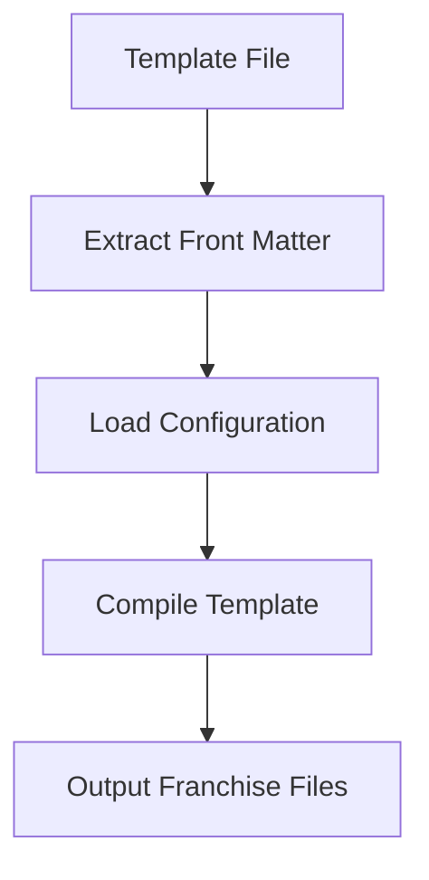

# Watcher Codebase Documentation 📜

This documentation targets maintainers and developers needing insight into the watcher script system's core logic and structure. For CLI usage instructions, refer to the CLI documentation.

## Contents 📋
- [Watcher Codebase Documentation 📜](#watcher-codebase-documentation-)
  - [Contents 📋](#contents-)
  - [System Overview 🌐](#system-overview-)
  - [Core Components 🛠️](#core-components-️)
    - [1. Entry Point (`src/scripts/watcher/index.mjs`) 🚀](#1-entry-point-srcscriptswatcherindexmjs-)
    - [2. Core Modules 🧩](#2-core-modules-)
  - [Key Files and Structure 📁](#key-files-and-structure-)
  - [Core Logic Flow 🔄](#core-logic-flow-)
  - [Key Technical Concepts ⚙️](#key-technical-concepts-️)
  - [Development Guidelines 📖](#development-guidelines-)
  - [Core Module Logic 🧠](#core-module-logic-)
  - [Dependencies 🧰](#dependencies-)

## System Overview 🌐
The watcher system, built in Node.js, automates template compilation across multiple franchises. It integrates modules for template processing, data management, and real-time file watching.

## Core Components 🛠️

### 1. Entry Point (`src/scripts/watcher/index.mjs`) 🚀
- Parses CLI flags to direct execution:
  - 🔍 `watch`: Monitors file changes, recompiles templates, and writes franchise-specific files (default if no flags).
    *Command*: `npm run watcher`
  - 🛠️ `make`: Resets and regenerates configuration from template data.
    *Command*: `npm run watcher --make`
  - 🌍 `launch`: Starts the data viewer server.
    *Command*: `npm run watcher --launch`
  - 📦 `compile`: Processes all templates in `./watcher` and generates franchise-specific files.
    *Command*: `npm run watcher --compile`

### 2. Core Modules 🧩
- **File Watcher (`logic/index.mjs`)** 👀
  Uses `chokidar` to watch `./watcher`, triggering compilation on changes with debouncing to limit merge operations.
- **Template Compiler (`modules/compile-template.mjs`)** ✂️
  Processes templates, extracts front matter via `gray-matter`, and applies franchise-specific configurations.
- **Data Management** 💾
  - `logic/make.mjs`: Generates initial configuration from templates.
  - `logic/merge.mjs`: Syncs template front matter with `config/config.json`.
- **Data Viewer (`data-view/`)** 🖥️
  An Express.js-based web UI (`logic/launch.mjs`) for real-time configuration viewing and editing.

## Key Files and Structure 📁

```plaintext
src/scripts/watcher/
├── config/
│   ├── config.json         # Stores central configuration
│   └── franchises.mjs      # Defines franchises
├── data-view/              # Web UI components
├── logic/                  # Core logic modules
└── modules/                # Shared utilities

```

##  Core Logic Flow 🔄



## Key Technical Concepts ⚙️
1. **Template Compilation** 📝
   - Uses JavaScript template literals for dynamic content.
   - Front matter specifies template configuration.
   - Global configuration is accessible to all templates.
2. **Configuration Synchronization** 🔗
   - Ensures consistency between front matter and central config.
   - Supports property addition/removal and franchise overrides.
3. **File Structure** 🗂️
   - Auto-generates franchise-specific directories.
   - Preserves template-to-output structure for `.aspx` and `.ascx` files.

## Development Guidelines 📖
1. **Adding Features** ➕
   - Update CLI flags in `index.mjs`.
   - Add logic in `modules/`.
   - Adjust configuration schema if required.
2. **Modifying Templates** ✏️
   - Follow front matter conventions.
   - Use template literals for global/franchise data.
3. **Configuration Changes** 🔧
   - Test via data viewer.
   - Confirm propagation across franchises.

## Core Module Logic 🧠
1. **Watcher (`logic/index.mjs`)** 👁️
   Monitors `./watcher` with `chokidar`, debounces merges, and triggers compilation for `.aspx`/`.ascx` files.
2. **Make (`logic/make.mjs`)** 🏗️
   Builds initial `config.json` by processing template front matter and franchise data.
3. **Merge (`logic/merge.mjs`)** 🔄
   Syncs template changes with config, caching states and updating only on detected changes.
4. **Compile Template (`modules/compile-template.mjs`)** 📑
   Extracts front matter, applies config, and generates franchise-specific outputs.
5. **Set Data and Render (`modules/set-data-and-render-template.mjs`)** 🎨
   Merges config with template data, evaluates templates, and writes files to franchise paths.
6. **Process All Files (`modules/process-all-files.mjs`)** 📚
   Batch-processes templates, filtering out ignored files and duplicates.

## Dependencies 🧰
- `chokidar`: File watching
- `gray-matter`: Front matter parsing
- `shelljs`: File system operations
- `express`: Data viewer server